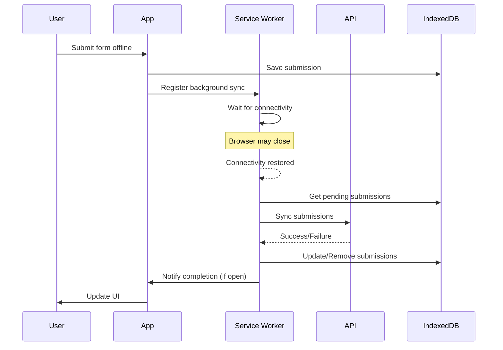

# Background Sync Implementation

**Last Updated**: 2025-10-30
**Status**: ✅ Implemented
**Issue**: [#24](https://github.com/FRC930/scouting/issues/24)

## Overview

Background Sync API integration enables automatic synchronization of offline submissions even when the browser tab is closed or in the background. This feature significantly improves the reliability of offline data collection by ensuring submissions are eventually synced without user intervention.

## Key Features

### 🚀 Automatic Background Synchronization
- Submissions sync automatically when connectivity is restored
- Works even with browser tab closed (Chrome/Edge only)
- No user intervention required

### 🔄 Graceful Fallback
- Detects browser support for Background Sync API
- Falls back to auto-sync for unsupported browsers (Firefox, Safari)
- Manual sync button always available as backup

### 📊 Visual Feedback
- "Will sync in background" indicator for supported browsers
- "Sync Now" button for manual control in unsupported browsers
- Real-time pending submission count

## Architecture

### Components

#### 1. **BackgroundSyncAdapter** (`/src/infrastructure/offline/adapters/BackgroundSyncAdapter.ts`)
- Bridge between service worker and offline infrastructure
- Provides browser compatibility checking
- Manages sync tag registration

#### 2. **Custom Service Worker** (`/public/sw-custom.js`)
- Handles background sync events
- Manages IndexedDB operations in worker context
- Replays failed requests when online

#### 3. **useBackgroundSync Hook** (`/src/hooks/useBackgroundSync.ts`)
- React hook for component integration
- Provides sync registration and status
- Manages pending sync tags

#### 4. **Enhanced SyncStatusIndicator** (`/src/components/offline/SyncStatusIndicator.tsx`)
- Shows different UI based on browser support
- Auto-registers background sync when needed
- Visual feedback for sync state

### Flow Diagram



## Browser Compatibility

| Browser | Background Sync Support | Fallback Behavior |
|---------|------------------------|-------------------|
| Chrome | ✅ Full support | N/A |
| Edge | ✅ Full support | N/A |
| Firefox | ❌ Not supported | Auto-sync every 30s |
| Safari | ❌ Not supported | Auto-sync every 30s |
| Mobile Chrome | ✅ Full support | N/A |
| Mobile Safari | ❌ Not supported | Auto-sync every 30s |

## Implementation Details

### Service Worker Registration

The custom service worker is imported via the PWA configuration in `next.config.ts`:

```typescript
workboxOptions: {
  importScripts: ['/sw-custom.js'],
  // ... other options
}
```

### IndexedDB Schema

The service worker uses the following IndexedDB structure:

```javascript
Database: 'offline-submissions'
Version: 1
Object Store: 'submissions'
  - keyPath: 'id'
  - Indexes: ['timestamp', 'type']
```

### Sync Event Handling

When a sync event fires:
1. Service worker opens IndexedDB
2. Retrieves all pending submissions
3. Attempts to sync each submission
4. Removes successful submissions from queue
5. Re-registers sync if failures exist
6. Notifies open tabs of completion

### Message Communication

Service Worker → App messages:
```javascript
{
  type: 'SYNC_COMPLETE',
  totalCount: number,
  successCount: number,
  failedCount: number,
  failedIds: string[],
  timestamp: string
}
```

## Usage

### Basic Usage

The feature works automatically once integrated. No explicit code changes needed in forms:

```tsx
// Automatic - submissions are queued and background sync is registered
function ScoutingForm() {
  const { submit } = useSubmission();

  const handleSubmit = async (data) => {
    await submit(data); // Background sync registered automatically
  };

  return <form onSubmit={handleSubmit}>...</form>;
}
```

### Manual Sync Trigger

For browsers without Background Sync support:

```tsx
import { useSyncQueue } from '@/lib/offline';

function ManualSync() {
  const { pendingCount, sync, isSyncing } = useSyncQueue();

  return (
    <button onClick={sync} disabled={isSyncing}>
      Sync {pendingCount} submissions
    </button>
  );
}
```

### Checking Browser Support

```tsx
import { useBackgroundSync } from '@/hooks/useBackgroundSync';

function SyncInfo() {
  const { isSupported, pendingTags } = useBackgroundSync();

  if (isSupported) {
    return <p>Background sync supported! Tags: {pendingTags.join(', ')}</p>;
  }

  return <p>Background sync not supported - using fallback</p>;
}
```

## Testing

### Manual Testing

#### Test 1: Basic Background Sync
1. Open Chrome DevTools → Application → Service Workers
2. Verify custom service worker is active
3. Go to Network tab, set to "Offline"
4. Submit a scouting form
5. Check "Will sync in background" appears
6. Close browser tab completely
7. Wait 30 seconds
8. Reopen browser (online)
9. Check Supabase - submission should be synced

#### Test 2: Browser Compatibility
1. **Chrome/Edge**: Should see "Will sync in background"
2. **Firefox/Safari**: Should see "Sync Now" button
3. Both should successfully sync when online

#### Test 3: Multiple Submissions
1. Go offline
2. Submit 5 forms quickly
3. Verify "5 pending submissions" appears
4. Go online
5. All should sync automatically

### Automated Testing

Run E2E tests:
```bash
npm run test:e2e -- background-sync.spec.ts
```

Tests cover:
- Background sync registration
- Browser compatibility detection
- Fallback behavior
- Multiple submission handling
- Service worker messaging

## Troubleshooting

### Common Issues

#### Background Sync Not Working

**Symptoms**: Submissions don't sync when tab is closed
**Causes**:
1. Browser doesn't support Background Sync API
2. Service worker not registered properly
3. PWA disabled in development

**Solutions**:
1. Check browser compatibility (Chrome/Edge required)
2. Verify service worker in DevTools
3. Ensure `NODE_ENV=production` or remove PWA disable in dev

#### Service Worker Not Loading

**Symptoms**: No service worker in DevTools
**Solutions**:
1. Clear browser cache and reload
2. Check console for registration errors
3. Verify `/sw.js` and `/sw-custom.js` exist in public folder

#### IndexedDB Errors

**Symptoms**: Submissions not being queued
**Solutions**:
1. Clear IndexedDB in DevTools → Application → Storage
2. Check for quota exceeded errors
3. Verify database schema matches

### Debug Commands

Check service worker status:
```javascript
// In browser console
navigator.serviceWorker.ready.then(reg => {
  console.log('SW State:', reg.active?.state);
  console.log('SW URL:', reg.active?.scriptURL);
});
```

Check Background Sync registration:
```javascript
// In browser console
navigator.serviceWorker.ready.then(async (reg) => {
  const tags = await reg.sync.getTags();
  console.log('Sync tags:', tags);
});
```

Manually trigger sync:
```javascript
// In browser console
navigator.serviceWorker.ready.then(reg => {
  reg.sync.register('submission-sync');
});
```

## Performance Considerations

### Battery Impact
- Background Sync is designed to be battery-efficient
- Browser controls when sync occurs based on:
  - Network conditions
  - Battery level
  - User engagement

### Network Usage
- Batches multiple submissions together
- Uses exponential backoff for failures
- Respects user's data saver preferences

### Storage Limits
- IndexedDB typically allows 50% of free disk space
- Old submissions are pruned after successful sync
- Monitor quota usage in production

## Security Considerations

### Data Protection
- Submissions stored in IndexedDB are isolated per origin
- No cross-origin access possible
- Data encrypted at rest on some platforms

### Authentication
- Auth tokens included in sync requests
- Token refresh handled automatically
- Failed auth results in sync retry

## Future Enhancements

### Potential Improvements
1. **Periodic Background Sync** - Schedule regular sync intervals
2. **Selective Sync** - Priority-based submission syncing
3. **Conflict Resolution** - Handle simultaneous edits
4. **Progress Reporting** - Detailed sync progress in UI
5. **Offline Analytics** - Track sync success rates

### API Improvements
```typescript
// Potential future API
interface BackgroundSyncOptions {
  priority: 'high' | 'normal' | 'low';
  requiresCharging?: boolean;
  requiresNetwork?: 'any' | 'unmetered';
  maxRetries?: number;
  timeout?: number;
}
```

## References

- [MDN Background Sync API](https://developer.mozilla.org/en-US/docs/Web/API/Background_Synchronization_API)
- [Google Developers - Background Sync](https://developers.google.com/web/updates/2015/12/background-sync)
- [Service Worker Cookbook](https://serviceworke.rs/background-sync.html)
- [Can I Use - Background Sync](https://caniuse.com/background-sync)

## Related Documentation

- [Offline Infrastructure](/docs/features/offline/OFFLINE_INFRASTRUCTURE.md)
- [PWA Setup](/docs/setup/PWA_SETUP.md)
- [Service Worker Guide](/docs/features/offline/SERVICE_WORKER.md)